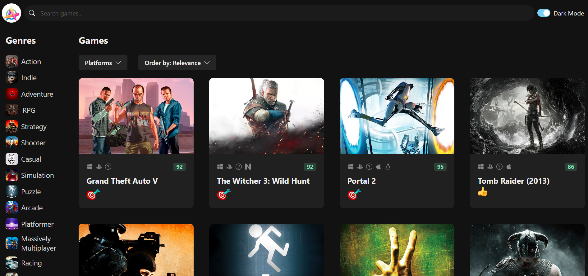

# GameHub

GameHub is a video game discovery web app that helps you find new and interesting games to play. With GameHub, you can search for games by platform, genre, and more. 

## Getting Started

To get started with GameHub, follow these steps:

1. Clone this repository to your local machine.
2. Run `npm install` to install the required dependencies.
3. Get a RAWG API key at https://rawg.io/apidocs. You'll have to create an account first. 
4. Add the API key to **src/services/api-client.ts**
5. Run `npm run dev` to start the web server. 

(<a href="#readme-top">back to top</a>)

LIVE IMAGE

LIVE DEMO 

## 🚀 Live Demo 

- [Live Demo Link]()

(<a href="#readme-top">back to top</a>)

<!-- AUTHORS -->

## 👥 Authors 

👤 **Author1**

- GitHub: [@uno36](https://github.com/uno36)
- Twitter: [@tofauemmanuel](https://twitter.com/tofauemmanuel)
- LinkedIn: [LinkedIn](https://www.linkedin.com/in/emmanuel-tofa-673b2516a/)

(<a href="#readme-top">back to top</a>)

## 🤝 Contributing 

Contributions, issues, and feature requests are welcome!

Feel free to check the [issues page](../../issues/).

(<a href="#readme-top">back to top</a>)

<!-- SUPPORT -->

## ⭐️ Show your support 

If you like this project feel free to contact me and we can schedule a meet.

(<a href="#readme-top">back to top</a>)

<!-- ACKNOWLEDGEMENTS -->

## 🙏 Acknowledgments 

I would like to thank ALX for their impressive curriculum and continuos guidence torwards making me one of the best web developers

(<a href="#readme-top">back to top</a>)

<!-- LICENSE -->

## 📝 License 

This project is [MIT](LICENSE) licensed.

(<a href="#readme-top">back to top</a>)

